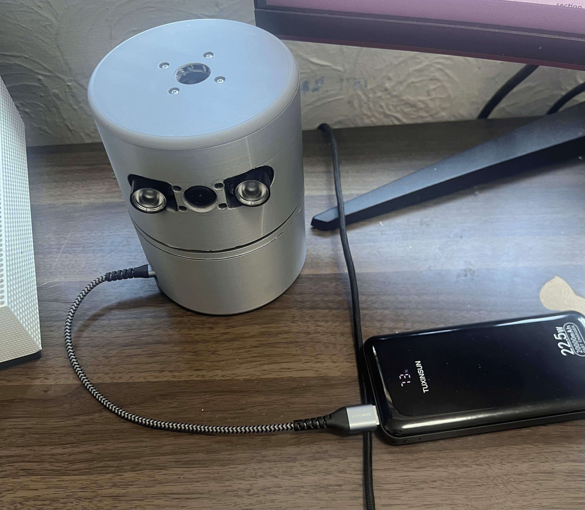
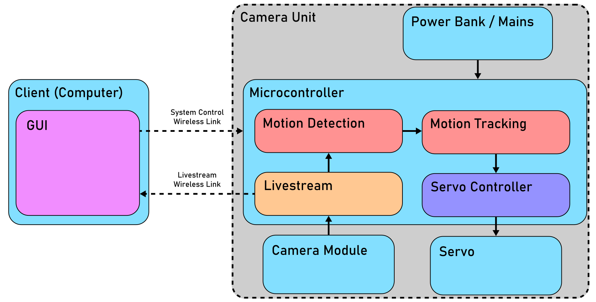
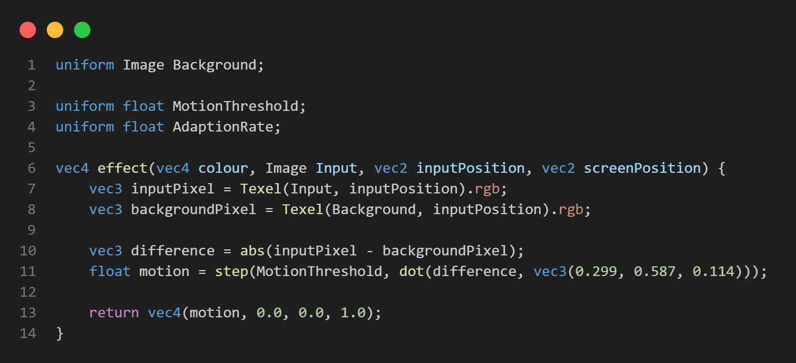
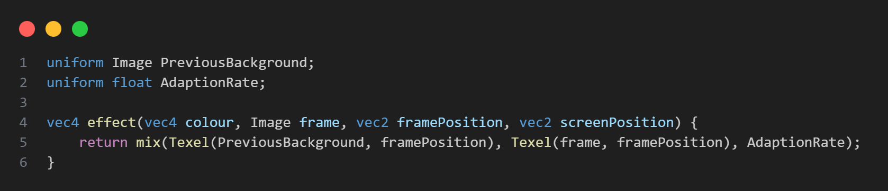
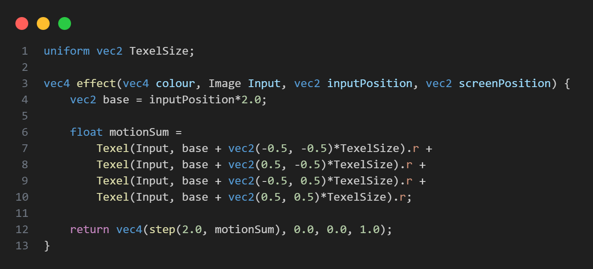
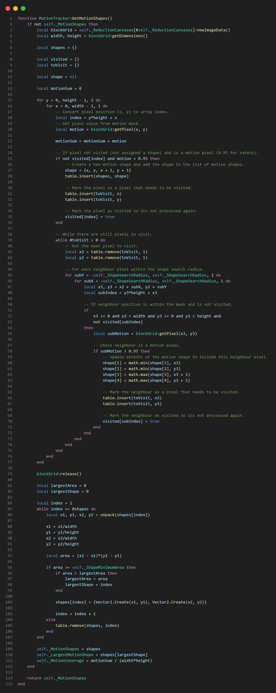
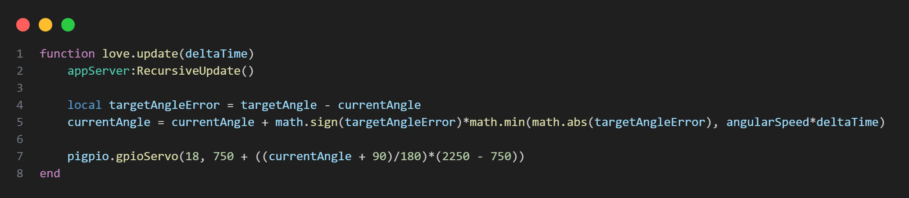

# Domestic Motion Tracking Security Camera Project
## 1. Introduction:

This project is a low cost, subscription free domestic motion tracking security camera that performs all image processing and tracking locally, without relying on third party cloud infrastructure. Built around a Raspberry Pi Zero 2W and a single pan servo, the unit captures video at 720p/30 fps and actively tracks a moving subject within its field of view.

The software executes a custom motion detection and tracking pipeline written in Lua (via LuaJIT). To ensure real time performance on constrained hardware, performance critical stages are offloaded to the Pi's integrated GPU using GLSL fragment shaders.

## 2. Contextual Overview:

The system architecture is divided into two primary networked subsystems:

-   **Camera Unit (Microcontroller)**: Handles real time video capture, GPU accelerated motion detection, motion tracking and physical servo control. It also encodes the video stream using H.264 to send over the local network.
    
-   **Client (Computer)**: A remote graphical user interface (GUI) that receives the livestream and allows the user to wirelessly configure tracking parameters and monitor the system.

## 3. Installation Instructions:
### Client:

 1. Download and install [FFmpeg](https://ffmpeg.org/download.html) v8 and make sure the path to the "bin" folder is set within your PATH environment variable.
 2. Download and install [LÖVE 2D](https://www.love2d.org/) v11.5 and make sure the path to the executable is set within your PATH environment variable.
 3. Clone this repository.
 4. Done.

### Camera:
 1. Setup [Raspberry Pi](https://www.raspberrypi.com/documentation/computers/getting-started.html) (Recommend using the Lite OS to maximise performance and reduce power consumption).
 2. Download and install  [FFmpeg](https://ffmpeg.org/download.html)  v8 (using "apt" will usually setup the environment variables for you).
 3. Download and install [LÖVE 2D](https://www.love2d.org/) v11.5.
 4. Download and install [pigpio](https://abyz.me.uk/rpi/pigpio/download.html).
 5. Clone this repository.
 6. Done.

## 4. How to Run the Software:

### Client:

 1. Open a terminal inside the root of the cloned repository.
 2. Run `love . Client`.

### Camera:

 1. Open a terminal inside the root of the cloned repository.
 2. Run `sudo love . Camera`.

## 5. Technical Details:

To ensure real time performance on the Raspberry Pi Zero 2W without relying on heavy machine learning frameworks, the system employs a highly optimized classical computer vision pipeline. The core algorithms are broken down into three main stages: Motion Detection, Motion Tracking and Servo Control.

The actual implementations of the more complex algorithms are also given when deemed appropriate. 

### 5.1. Motion Detection:

The goal of this stage is to isolate moving pixels by comparing the current video frame $I_t(x,y)$ to a continuously updated background model $B_t(x,y)$.

1.  **Background Subtraction:** First, the absolute difference between the current frame and the background model is calculated:
    
    $$D_t(x,y)=|I_t(x,y)-B_t(x,y)|$$
    
2.  **Motion Mask Generation:** The RGB difference is converted into a single luminance value reflecting perceived brightness differences, using the standard Rec. 601 luma formulation:
    
    $$L_t(x,y)=D_t(x,y)\cdot(0.299,0.587,0.114)$$
    
    A binary motion mask $M_t(x,y)$ is then generated by applying a motion threshold $T$:
    
    $$M_t(x,y)=\begin{cases}1,L_t(x,y)\ge T\\ 0,&otherwise\end{cases}$$
    

<b>GLSL implementation of (1) and (2)</b>

    
3.  **Background Image Update:** To adapt to gradual lighting changes in the room, the background model is updated using an exponential moving average controlled by the adaptation rate $\alpha$:
    
    $$B_{t+1}(x,y)=(1-\alpha)B_t(x,y)+\alpha I_t(x,y)$$
    

<b>GLSL implementation of (3)</b>

### 5.2. Motion Tracking:

Once the motion mask is generated, the system identifies and tracks the most significant moving object.

1.  **Motion Mask Subdivision:** To improve efficiency and filter noise, the motion mask is subdivided. A $2\times 2$ grid of input pixels is summed to find $\lambda(x,y)$:
    
    $$\lambda(x,y)=M(2x,2y)+M(2x+1,2y)+M(2x,2y+1)+M(2x+1,2y+1)$$
    
    A threshold of 2 is applied to ensure noise (isolated pixels) is filtered out while true motion passes through to the new output mask $M'$:
    
    $$M'(x,y)=\begin{cases}1,\lambda(x,y)\ge 2\\ 0,&otherwise\end{cases}$$
 
    

<b>GLSL implementation of (1)</b>

2.  **Bounding Box Generation & Selection:** The algorithm groups nearby motion pixels within a defined "shape search radius" into bounding boxes. The area $A_n$ of each box is calculated and boxes smaller than the "shape minimum area" are discarded:
    
    $$A_n=(x_{max}-x_{min})(y_{max}-y_{min})$$
    
    The system then selects the bounding box with the largest area as the primary tracking target.

<b>Lua implementation of (2)</b>

3.  **Target Normalization:** The center of the selected bounding box is normalized relative to the frame's width $W$ and height $H$:
    
    $$P_T=(\frac{x_{min}+x_{max}}{2W},\frac{y_{min}+y_{max}}{2H})=(x_T,y_T)$$
    
4.  **Servo Angle Adjustment:** Since this is a single pan-servo system, only the horizontal coordinate $x_T$ is used. The coordinate is rescaled to a $[-1, 1]$ range to represent the horizontal error $x_e$ relative to the center:
    
    $$x_e=2x_T-1$$
    
    This error is passed through a proportional controller using the angle control coefficient $k_a$ to calculate the required angle adjustment $\Delta\theta$:
    
    $$\Delta\theta=k_a x_e$$
    

### 5.3. Servo Controller:

The final stage safely applies the calculated angle adjustment to the physical hardware.

1.  **Angle Clamping:** The target angle $\theta_t$ is calculated based on the current angle $\theta_c$ and the adjustment $\Delta\theta$. It is clamped to the servo's physical limits ($-90^{\circ}$ to $90^{\circ}$):
    
    $$\theta_t=clamp(\theta_c+\Delta\theta,-90,90)$$
    
2.  **Speed Limiting:** To prevent erratic snapping, the camera pans gradually toward the target angle. The rate of change is restricted by the servo angular speed limit $\omega_s$:
    
    $$\theta_c=\theta_c+sign(\theta_t-\theta_c)min(|\theta_t-\theta_c|,\omega_s \Delta t)$$
    
3.  **PWM Conversion:** Finally, the new physical angle is mapped linearly to a PWM duty cycle $d$ required by the servo motor hardware, bounded by the motor's minimum and maximum duty cycles:
    
    $$d=d_{min}+\frac{\theta_c+90}{180}(d_{max}-d_{min})$$

<b>Lua implementation of (2) and (3)</b>

## 6. Known Issues and Future Improvements:

-   **Known Issues**:
    
    -   **Settling Delay**: Because the detection algorithm relies on a static background model, every camera movement invalidates the model. The system must pause tracking for a 1.0 s "settling delay" after every servo movement so the background model can adapt to the new view.
        
    -   **Single Subject Assumption**: The camera tracks the largest moving shape, meaning it cannot distinguish between a human, a pet or moving curtains and it will struggle to track smoothly if multiple subjects are in the frame.
        
-   **Future Improvements**:
    
    -   **Machine Learning Integration**: Replacing the classical frame differencing pipeline with a machine learning object detector (like YOLO) would eliminate the settling delay and allow the camera to selectively track specific objects (for example, people only). This would require a hardware upgrade to a more powerful board, such as the Raspberry Pi 5.
        
    -   **Security and Encryption**: The current prototype transmits video and control data in plaintext. Future iterations should secure network traffic using TLS for the control channel and SRTP for the video stream.

## 7. Credits:
Client icons: https://feathericons.com/